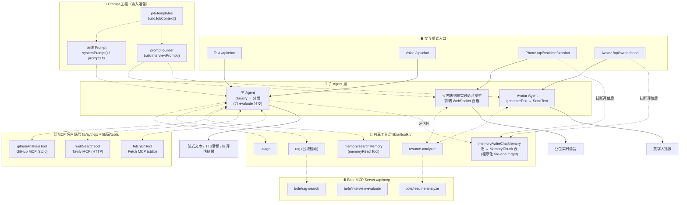
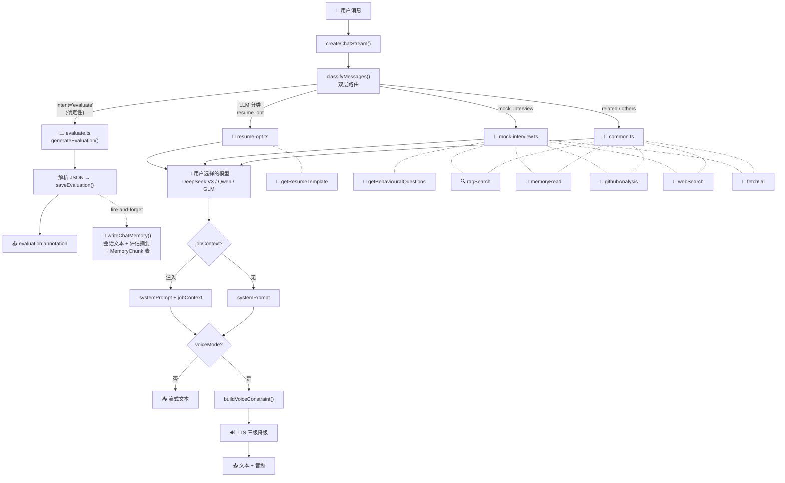
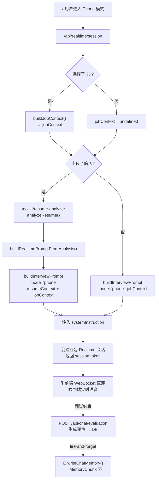
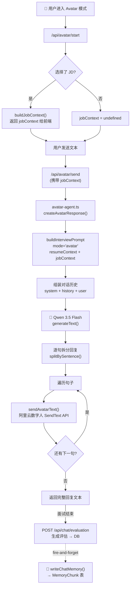
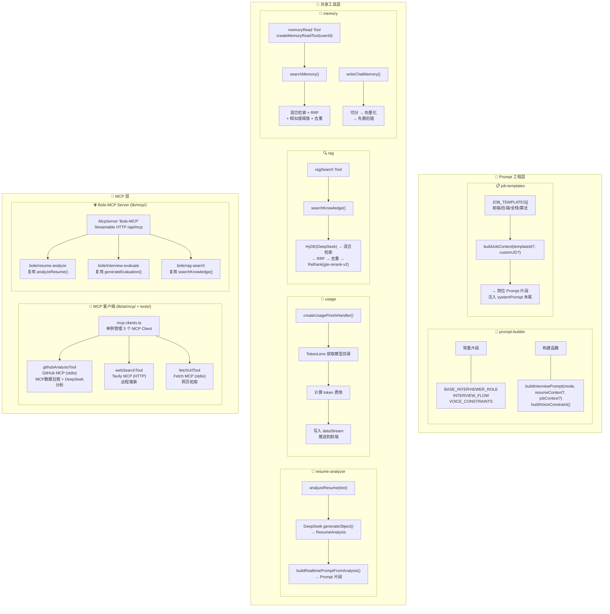
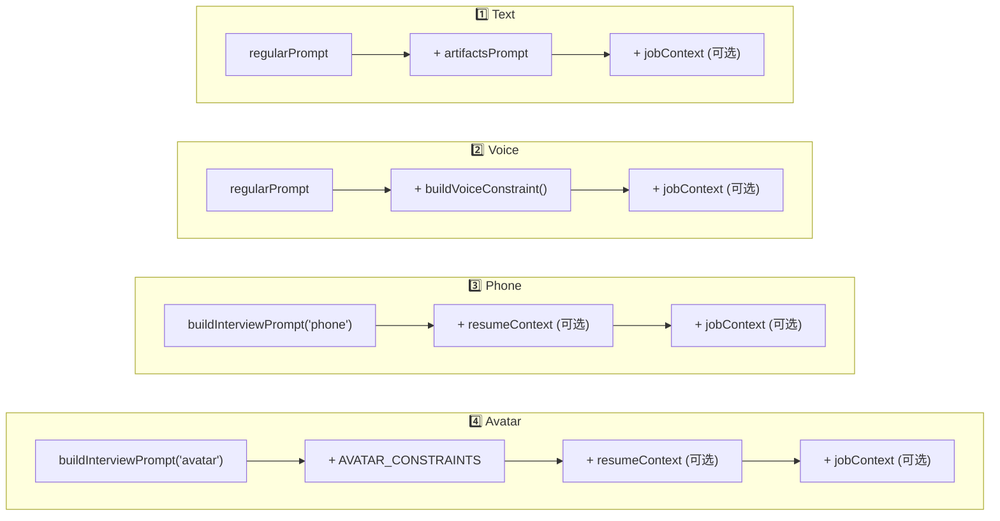

<div align="center">
  <h1>🎯 伯乐Talk Agent</h1>
  <p><strong>面向程序员求职场景的 AI 面试辅助智能体</strong></p>
  <p>
    基于 Vercel AI SDK 的「共享工具/MCP 层 + 子 Agent」架构，支持 Text / Voice / Phone / Avatar 四种交互模式。<br/>
    包含 MCP 双向集成、RAG 知识库检索、Agent 记忆系统、面试评估持久化与 JD 模板注入。
  </p>
</div>

---

## ✨ 项目简介

伯乐Talk 是一个**全栈 AI Agent 产品**，帮助程序员完成简历优化、模拟面试、面试题解答和结构化面试评估。它不是简单的问答 ChatBot，而是一个具备意图分类、多 Agent 分发、Tool Calling、RAG 知识库检索和跨会话记忆的完整 Agent 系统。

用户可以上传 PDF 简历、选择目标岗位 JD 模板，Agent 会围绕岗位要求进行模拟面试，结束后生成五维度评分的结构化评估报告。

### 四种面试模式

| 模式 | 描述 |
|:---|:---|
| **💬 Text** | 纯文本对话，SSE 流式输出，支持 Markdown 渲染 |
| **🎙️ Voice** | 文本基础上增加双向流式 TTS（豆包/CosyVoice WebSocket）+ 前端阿里云 NLS 流式 ASR |
| **📞 Phone** | 豆包端到端实时语音大模型，通过 Cloudflare Durable Object 双 WebSocket 桥接代理 |
| **🎥 Avatar** | 阿里云 3D 数字人视频面试，浏览器端 Silero VAD + 流式 ASR 自研语音 Pipeline |

---

## 🏗️ 技术架构

### 技术栈一览

| 层级 | 技术 |
|:---|:---|
| 前端框架 | Next.js 16 (App Router) + React |
| AI SDK | Vercel AI SDK (`@ai-sdk/react`, `ai`) |
| AI 模型 | DeepSeek V3（默认对话 + 内部管线）/ Qwen 3.5 Flash / GLM-4-Air |
| 数据库 | Neon PostgreSQL + Drizzle ORM + pgvector |
| 认证 | NextAuth.js（邮箱登录 + 游客模式）|
| 向量检索 | 智谱 Embedding-3 (1024维) + HNSW/GIN 索引 |
| MCP 客户端 | GitHub MCP (stdio) / Tavily MCP (HTTP) / Fetch MCP (stdio) |
| MCP 服务端 | Bole-MCP Server (Streamable HTTP Transport) |
| 部署 | 阿里云 Serverless FC + Cloudflare Workers (Phone 模式) |
| 监控 | cron-job.org + 自建心跳 API |

---

## 📐 整体架构图

### 图1：分层架构总览（共享工具/MCP 层 + 子 Agent）



---

### 图2：主 Agent 内部流水线（Text / Voice）



---

### 图3：Phone 模式流程（Prompt 配置 + 端到端实时语音）



---

### 图4：Avatar Agent 流程



---

### 图5：共享工具层 + Prompt 工程层详情



---

### 图6：四模式 Prompt 构建差异



---

## 📊 四种模式详细对比

| | **Text** | **Voice** | **Phone** | **Avatar** |
|:---|:---|:---|:---|:---|
| **入口** | `/api/chat` | `/api/chat` | `/api/realtime/session` | `/api/avatar/send` |
| **子 Agent** | 主 Agent (classify→分发) | 主 Agent (classify→分发) | 豆包端到端实时语音模型 | avatar-agent.ts |
| **模型** | 用户选择 (DS/Qwen/GLM) | 用户选择 (DS/Qwen/GLM) | 豆包端到端 | Qwen 3.5 Flash |
| **Prompt 构建** | `systemPrompt()` | 同左 + `buildVoiceConstraint()` | `buildInterviewPrompt('phone')` | `buildInterviewPrompt('avatar')` |
| **JD 模板** | ✅ 紧凑下拉 | ✅ 紧凑下拉 | ✅ 完整卡片 | ✅ 完整卡片 |
| **面试评估** | ✅ Agent 意图分发 | ✅ Agent 意图分发 | ✅ 独立 API | ✅ 独立 API |
| **resume-analyzer** | ❌ | ❌ | ✅ 可选 | ✅ 可选 |
| **usage** | ✅ | ✅ | ❌ | ❌ |
| **共享工具** | ragSearch, memoryRead | 同左 | 无 | 无 |
| **MCP 工具** | githubAnalysis, webSearch, fetchUrl | 同左 | 无 | 无 |
| **记忆读取** | ✅ LLM 自主调用 | ✅ LLM 自主调用 | ❌ | ❌ |
| **记忆写入** | ✅ 评估后 fire-and-forget | ✅ 评估后 fire-and-forget | ✅ 评估后 fire-and-forget | ✅ 评估后 fire-and-forget |
| **输出** | 流式文本 | 文本+TTS音频 | 实时语音 | 数字人播报 |

---

## 🔑 核心特性

### Agent 工作流

- **双层路由意图分类**：第一层确定性路由（前端按钮带 `intent` 参数直接跳过 LLM 分发），第二层 LLM 概率性分类（`generateObject` + Zod Schema 约束输出）
- **多 Agent 分发**：简历优化 / 模拟面试 / 面试评估 / 通用问答，各自有独立的 System Prompt 和 Tools
- **共享工具层**：`resume-analyzer`、`usage`、`rag`、`memory` 等模块一处实现多处复用

### RAG 知识库检索

- **多阶段管线**：HyDE（假设文档嵌入）→ 向量/全文混合检索 → RRF 融合排序 → 文本去重 → DashScope gte-rerank-v2 专用模型 ReRank
- **Markdown-aware 文档切分**：代码块保护 + 标题栈层级追踪 + 引用溯源

### Agent 记忆系统（per-user RAG）

- 面试评估完成后 fire-and-forget 异步写入会话文本和评估摘要
- per-user 数据隔离（`userId` 索引），轻量混合检索（无 HyDE/ReRank，低延迟优先）
- 工厂函数模式闭包绑定 `userId`，LLM 自主决定何时读取

### 面试评估三层缓存

```
第一层：React state（evaluationData）
  ↓ state 为空
第二层：GET /api/chat/evaluation → DB 查询
  ↓ DB 无记录
第三层：POST /api/chat/evaluation → generateEvaluation → DB 写入
```

| 模式 | 触发方式 | 缓存特点 |
|:---|:---|:---|
| Text / Voice | 「总结评价」按钮 → Agent intent 分发 | 发新消息清空缓存 |
| Phone / Avatar | 面试结束 → POST /api/chat/evaluation | 不重开不重生成 |

### MCP 协议双向集成

- **客户端**：接入 GitHub / Tavily / Fetch 三个外部 MCP Server，拓展 Agent 信息获取能力
- **服务端**：`Bole-MCP Server` 将简历分析、面试评估、RAG 检索三大能力通过 MCP 协议暴露给外部 AI 客户端

### 语音能力

- **Voice 模式**：双向流式 TTS（豆包 TTS 2.0 / CosyVoice WebSocket）+ 前端阿里云 NLS 流式 ASR + MSE 无缝播放 + 逐句 TTS 级联降级
- **Phone 模式**：Cloudflare Durable Object 双 WebSocket 桥接代理 + 手写豆包二进制帧协议编解码 + AudioContext 时间轴队列式播放
- **Avatar 模式**：浏览器端 Silero VAD ONNX 推理 + 音频预缓冲机制 + 打断式半双工 + 逐句 SendText 延迟优化

### 其他

- **PDF 简历解析**：前端 base64 编码 + 服务端 `pdf-parse` 文本提取 → Prompt 注入
- **JD 模板注入**：`buildJobContext()` 构建岗位 Prompt 片段，注入 System Prompt 末尾
- **API 速率限制**：游客 10 次/天、注册用户 30 次/天，前端 SVG 圆环进度条实时展示
- **部署**：阿里云 Serverless FC（标准 Node.js 运行时） + Cloudflare Workers（Phone 模式）+ Neon PostgreSQL + 域名 SSL + 心跳监控

---

## 🚀 本地运行

1. 安装依赖：

```bash
pnpm install
```

2. 配置环境变量（参考 `.env.example`）：

```bash
cp .env.example .env.local
# 编辑 .env.local 填写必要的 API Key
```

3. 初始化数据库：

```bash
pnpm db:migrate
```

4. 启动开发服务器：

```bash
pnpm dev
```

应用将运行在 [localhost:3000](http://localhost:3000)。

---

## 📁 项目结构

```
boletalk-agent/
├── app/                    # Next.js App Router 页面与 API Routes
│   ├── (chat)/             # 聊天页面
│   └── api/                # API 端点 (chat, tts, stt, avatar, realtime, mcp, monitor...)
├── lib/
│   ├── ai/
│   │   ├── agents/         # 子 Agent 层 (主 Agent 分发, Avatar Agent)
│   │   ├── toolkit/        # 共享工具层 (prompt-builder, resume-analyzer, usage, rag, memory)
│   │   ├── mcp/            # MCP 客户端 (GitHub, Tavily, Fetch)
│   │   └── tools/          # AI SDK Tool 封装
│   ├── mcp/                # MCP 服务端 (Bole-MCP Server)
│   └── db/                 # Drizzle ORM Schema 与数据库操作
├── components/             # React 组件
├── hooks/                  # 自定义 Hooks (STT, TTS, VAD...)
├── RAG-DOC/                # RAG 知识库文档
└── scripts/                # 索引构建脚本
```
